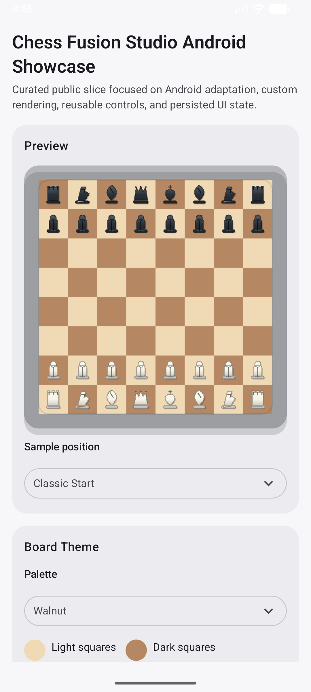
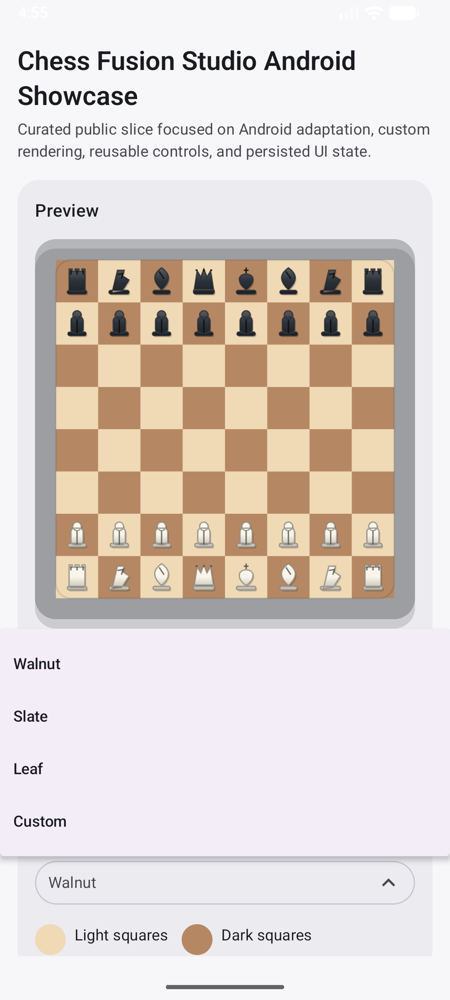
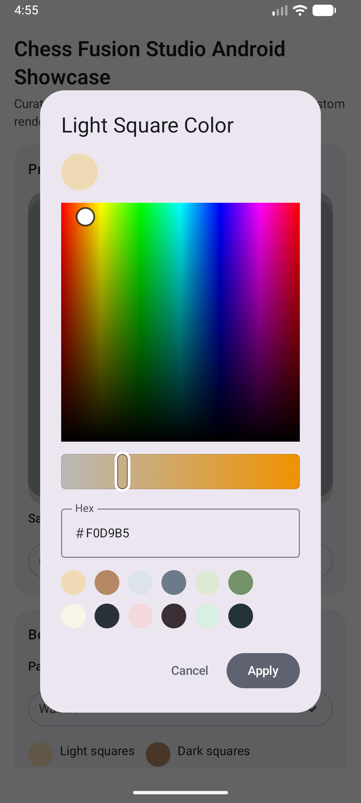
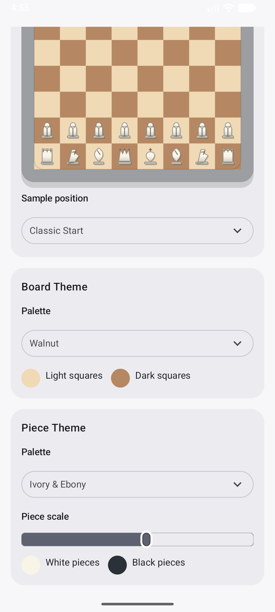
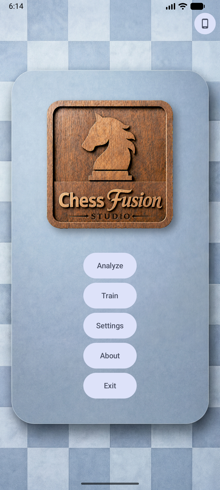
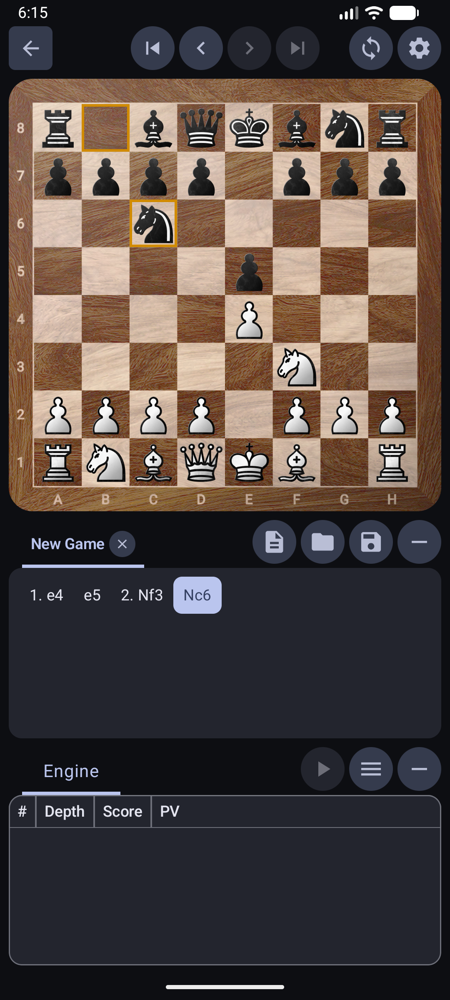
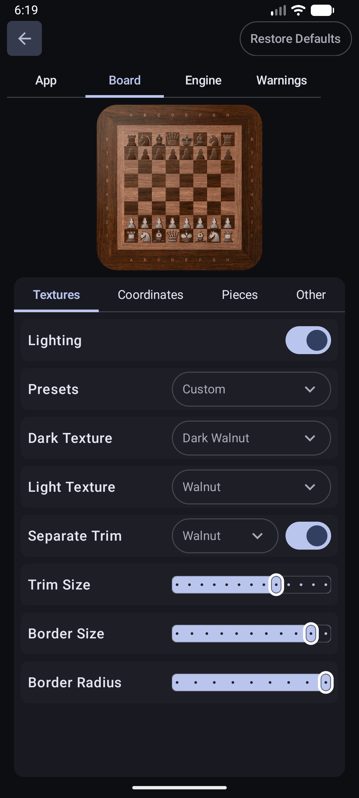
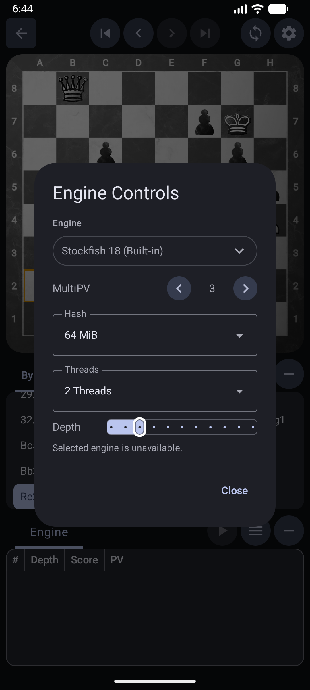
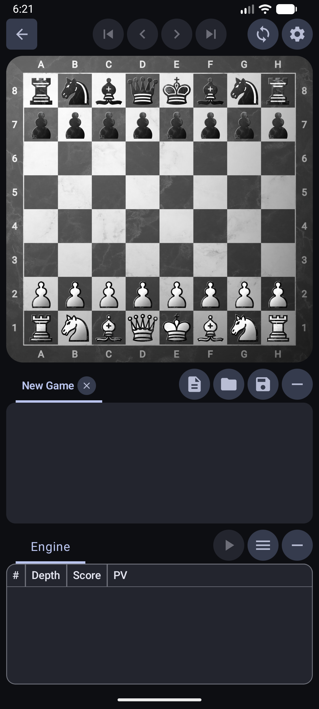
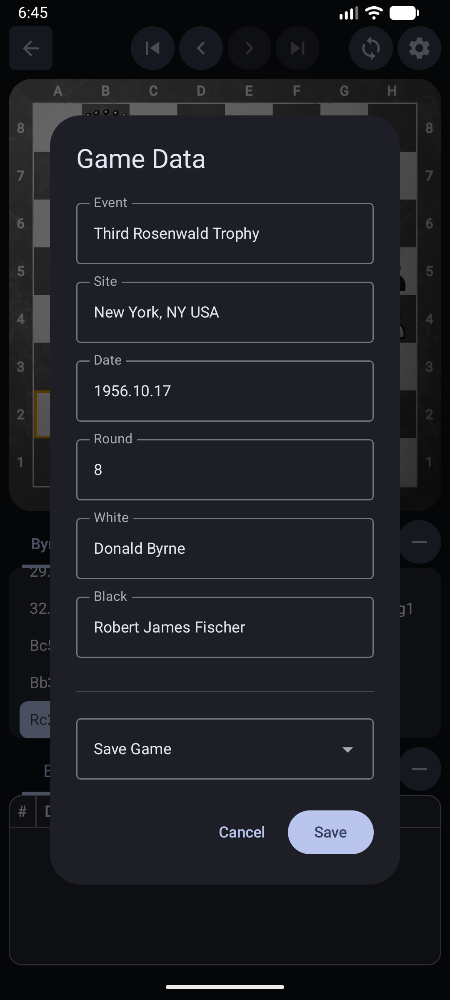

# Chess Fusion Studio Android Showcase

A compact Android portfolio repo derived from my private `ChessFusionStudio` project.
It highlights the parts most relevant to Android engineering review: Java domain modeling adapted into Kotlin/Compose, custom chessboard rendering, reusable UI controls, persisted UI state, and focused tests.

The full product remains private and is being prepared for a future Google Play release. This public repo is intentionally scoped to show engineering quality without exposing private product internals.

## Demo

<p>
  
  
  
  
</p>

## Full App Preview

Here are a few runtime screenshots from the full Android application:

<p>
  
  
  
</p>

<p>
  
  
  
</p>

## What To Review

- `core` / `app` separation: Java chess-domain model kept platform-independent, Android UI kept in Kotlin/Compose.
- Custom rendering: board geometry, square painting, piece masks, lighting, and live preview drawing.
- UI architecture: focused `Theme Studio` screen, reusable controls, custom slider, dropdowns, and color picker.
- State management: persisted settings mapped through a `ViewModel` and `StateFlow`.
- Engineering workflow: original Java chess foundation written by me, then adapted and curated with directed Codex/agentic AI assistance.

## Tech Stack

- Kotlin, Java
- Android, Jetpack Compose, Material 3
- ViewModel, StateFlow, SharedPreferences
- Custom Canvas drawing
- Gradle, JUnit

## Start Here

- [ThemeStudioScreen.kt](app/src/main/java/com/chessfusionstudio/showcase/ui/showcase/ThemeStudioScreen.kt)
- [ThemeStudioViewModel.kt](app/src/main/java/com/chessfusionstudio/showcase/ui/showcase/ThemeStudioViewModel.kt)
- [ShowcaseSettingsStore.kt](app/src/main/java/com/chessfusionstudio/showcase/data/settings/ShowcaseSettingsStore.kt)
- [ShowcaseBoardRenderer.kt](app/src/main/java/com/chessfusionstudio/showcase/boardimage/ShowcaseBoardRenderer.kt)
- [ShowcasePieceRenderer.kt](app/src/main/java/com/chessfusionstudio/showcase/ui/components/ShowcasePieceRenderer.kt)
- [ColorPickerDialog.kt](app/src/main/java/com/chessfusionstudio/showcase/ui/components/ColorPickerDialog.kt)
- [FenCodec.java](core/src/main/java/com/chessfusionstudio/core/io/FenCodec.java)

## Verify

Requires a standard Android development setup: JDK 17, Android SDK, and an emulator or physical device. Opening the repo in Android Studio will usually generate the local `local.properties` SDK path file.

From the repo root:

```powershell
.\gradlew :app:compileDebugKotlin
.\gradlew :core:test :app:testDebugUnitTest
```

To install the showcase on an emulator or device:

```powershell
.\gradlew :app:installDebug
```

## Public Scope

Included: selected domain model files, FEN parsing, curated sample positions, custom board/piece rendering, reusable Compose controls, persisted showcase settings, and unit tests.

Excluded: private PGN flows, engine communication, native engine assets, full move-generation/rules implementation, and broader product workflows.

For more context, see [architecture](docs/architecture.md), [public scope](docs/public-scope.md), and [migration story](docs/migration-story.md).

## Notice

This repository is public for portfolio review only. No license is granted for reuse, modification, or redistribution. See [NOTICE.md](NOTICE.md).
