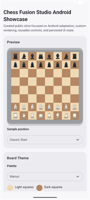
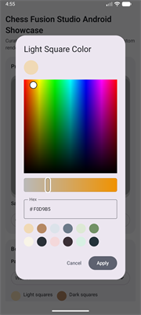
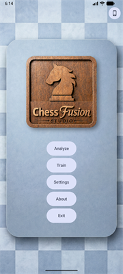
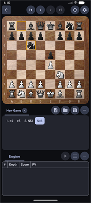
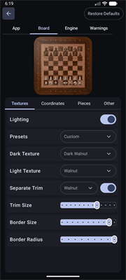
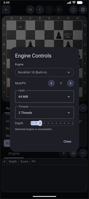
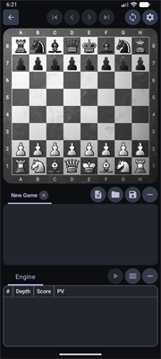
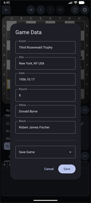

# Chess Fusion Studio Android Showcase

**By Rhett Langseth**

This is a curated public showcase derived from my private `ChessFusionStudio` project. This repo demonstrates selected engineering areas from the broader original work without exposing the entire codebase.

The full Android application is a modern mobile workspace for competitive chess players to analyze and archive their games, with aesthetic board and piece customization for a polished, personalized study experience.

## Agentic AI Collaboration

Both this showcase repo and the private `ChessFusionStudio` repo it was derived from were built through iterative collaboration with OpenAI Codex / agentic AI.
A core goal of this work is to demonstrate my ability to use agentic AI effectively: define scope, direct implementation, evaluate output quality, and drive the codebase toward a coherent engineering result.

## Public Showcase Scope

This repo is intentionally narrow. It focuses on the parts that best demonstrate Android engineering judgment without exposing the full private product surface. Below are the key features included in this public version.
- MVVM-style Kotlin/Compose architecture
- Java chess-domain modeling
- Custom board and piece rendering
- Reusable Compose controls
- Persisted live-preview settings
- Unit tests

## Showcase Screenshots

Here are a few screenshots from the public showcase application:




## Full App Preview

Here are a few runtime screenshots from the full Android application:









## What To Review

- `core` / `app` separation: Java chess-domain model kept platform-independent, Android UI kept in Kotlin/Compose.
- Custom rendering: board geometry, square painting, piece masks, lighting, and live preview drawing.
- UI architecture: focused `Theme Studio` screen, reusable controls, custom slider, dropdowns, and color picker.
- State management: persisted settings mapped through a `ViewModel` and `StateFlow`.
- Engineering workflow: original Java chess foundation written by me, then adapted and curated with directed Codex/agentic AI assistance.

## Showcase Flow

The showcase exposes one focused `Theme Studio` workflow:
- preview a sample chess position
- switch between curated sample positions
- adjust board and piece palettes
- fine-tune colors with a custom picker
- adjust piece scale with a custom slider
- see changes immediately in the rendered board

## Tech Stack

- Kotlin, Java
- Android, Jetpack Compose, Material 3
- ViewModel, StateFlow, SharedPreferences
- Custom Canvas drawing
- Gradle, JUnit

## Start Here

- [ThemeStudioScreen.kt](app/src/main/java/com/chessfusionstudio/showcase/ui/showcase/ThemeStudioScreen.kt)
- [ThemeStudioViewModel.kt](app/src/main/java/com/chessfusionstudio/showcase/ui/showcase/ThemeStudioViewModel.kt)
- [ShowcaseSettingsStore.kt](app/src/main/java/com/chessfusionstudio/showcase/data/settings/ShowcaseSettingsStore.kt)
- [ShowcaseBoardRenderer.kt](app/src/main/java/com/chessfusionstudio/showcase/boardimage/ShowcaseBoardRenderer.kt)
- [ShowcasePieceRenderer.kt](app/src/main/java/com/chessfusionstudio/showcase/ui/components/ShowcasePieceRenderer.kt)
- [ColorPickerDialog.kt](app/src/main/java/com/chessfusionstudio/showcase/ui/components/ColorPickerDialog.kt)
- [AppSlider.kt](app/src/main/java/com/chessfusionstudio/showcase/ui/components/AppSlider.kt)
- [FenCodec.java](core/src/main/java/com/chessfusionstudio/core/io/FenCodec.java)

## Verify

Requires a standard Android development setup: JDK 17, Android SDK, and an emulator or physical device. Opening the repo in Android Studio will usually generate the local `local.properties` SDK path file.

From the repo root:

```powershell
.\gradlew :app:compileDebugKotlin
.\gradlew :core:test :app:testDebugUnitTest
```

To install the showcase on an emulator or device:

```powershell
.\gradlew :app:installDebug
```

## Notice

This repository is public for portfolio review only. No license is granted for reuse, modification, or redistribution. See [NOTICE.md](NOTICE.md).
