# Chess Fusion Studio Android Showcase

**By Rhett Langseth**

[](https://github.com/RhettLangseth/ChessFusionStudioAndroidShowcase/actions/workflows/android.yml)

This is a curated public showcase derived from my private `ChessFusionStudio` project. This repo demonstrates selected engineering areas from the broader original work without exposing the entire codebase.

The full Android application is a modern mobile workspace for competitive chess players to analyze and archive their games, with aesthetic board and piece customization for a polished, personalized study experience.

## Agentic AI Collaboration

Both this showcase repo and the private `ChessFusionStudio` repo it was derived from were built through iterative collaboration with OpenAI Codex / agentic AI.
A core goal of this work is to demonstrate my ability to use agentic AI effectively: define scope, direct implementation, evaluate output quality, and drive the codebase toward a coherent engineering result.

## Public Showcase Scope

This repo is intentionally narrow. It focuses on the parts that best demonstrate Android engineering judgment without exposing the full private product surface. Below are the key features included in this public version.
- MVVM-style Kotlin/Compose architecture
- Java chess-domain modeling
- Custom board and piece rendering
- Reusable Compose controls
- Persisted live-preview settings
- Unit and UI tests with automated CI

## Showcase Screenshots

Here are a few screenshots from the public showcase application:

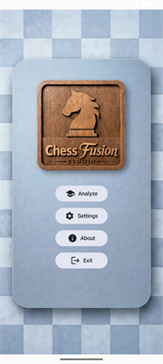
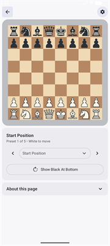
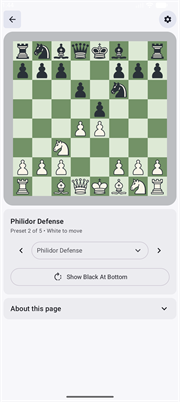
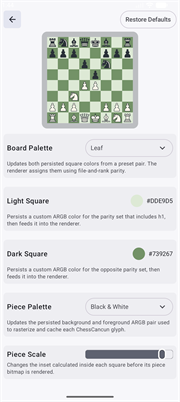
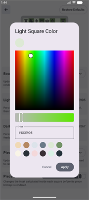
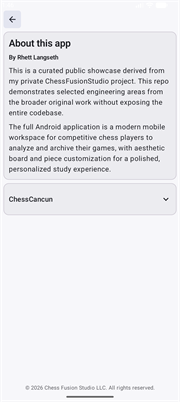

## Full Application Screenshots

Here are a few runtime screenshots from the full Android application:

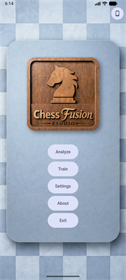
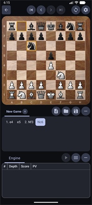
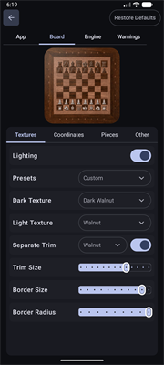

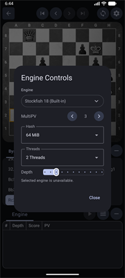
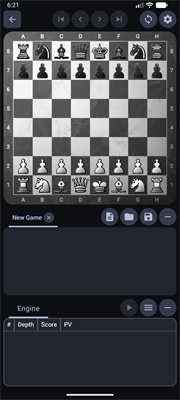
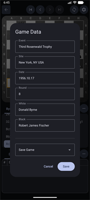

## Reviewer Guide

This showcase is organized around focused Analyze and Settings workflows. It demonstrates MVVM-style Compose architecture, Java chess-domain modeling, custom board and piece rendering, reusable controls, persisted state, automated tests, and an explicit public/private code boundary.

Recommended files to review:
- [ShowcaseSettingsScreen.kt](app/src/main/java/com/chessfusionstudio/showcase/ui/settings/ShowcaseSettingsScreen.kt)
- [ThemeStudioViewModel.kt](app/src/main/java/com/chessfusionstudio/showcase/ui/showcase/ThemeStudioViewModel.kt)
- [ShowcaseSettingsStore.kt](app/src/main/java/com/chessfusionstudio/showcase/data/settings/ShowcaseSettingsStore.kt)
- [ShowcaseBoardRenderer.kt](app/src/main/java/com/chessfusionstudio/showcase/boardimage/ShowcaseBoardRenderer.kt)
- [ShowcasePieceRenderer.kt](app/src/main/java/com/chessfusionstudio/showcase/ui/components/ShowcasePieceRenderer.kt)
- [ColorPickerDialog.kt](app/src/main/java/com/chessfusionstudio/showcase/ui/components/ColorPickerDialog.kt)
- [AppSlider.kt](app/src/main/java/com/chessfusionstudio/showcase/ui/components/AppSlider.kt)
- [FenCodec.java](core/src/main/java/com/chessfusionstudio/core/io/FenCodec.java)
- [Architecture](docs/architecture.md)
- [Public Scope](docs/public-scope.md)

What to try in the app:
- browse curated positions from the Analyze page
- flip the board to exercise the renderer's coordinate transform
- adjust board and piece palettes
- fine-tune colors with the custom picker
- adjust piece scale with the custom slider
- confirm settings persist after restarting the app

## Build, Test, and Run

Requires a standard Android development setup: JDK 17, Android SDK, and an emulator or physical device. Opening the repo in Android Studio will usually generate the local `local.properties` SDK path file.

From the repo root:

```powershell
.\gradlew :core:test :app:testDebugUnitTest :app:compileDebugAndroidTestKotlin :app:lintDebug :app:assembleDebug
```

To install the showcase on an emulator or device:

```powershell
.\gradlew :app:installDebug
```

With an emulator or device connected, run the persistence, navigation, and rendering-smoke tests:

```powershell
.\gradlew :app:connectedDebugAndroidTest
```

## Tech Stack

- Kotlin, Java
- Android, Jetpack Compose, Material 3
- ViewModel, StateFlow, SharedPreferences
- Custom Canvas drawing
- Gradle, JUnit, Compose UI testing, GitHub Actions

## Notice

This repository is public for portfolio review only. No license is granted for reuse, modification, or redistribution of the original showcase code or original assets. Third-party ChessCancun assets are governed by their own provenance and license details. See [NOTICE.md](NOTICE.md).
